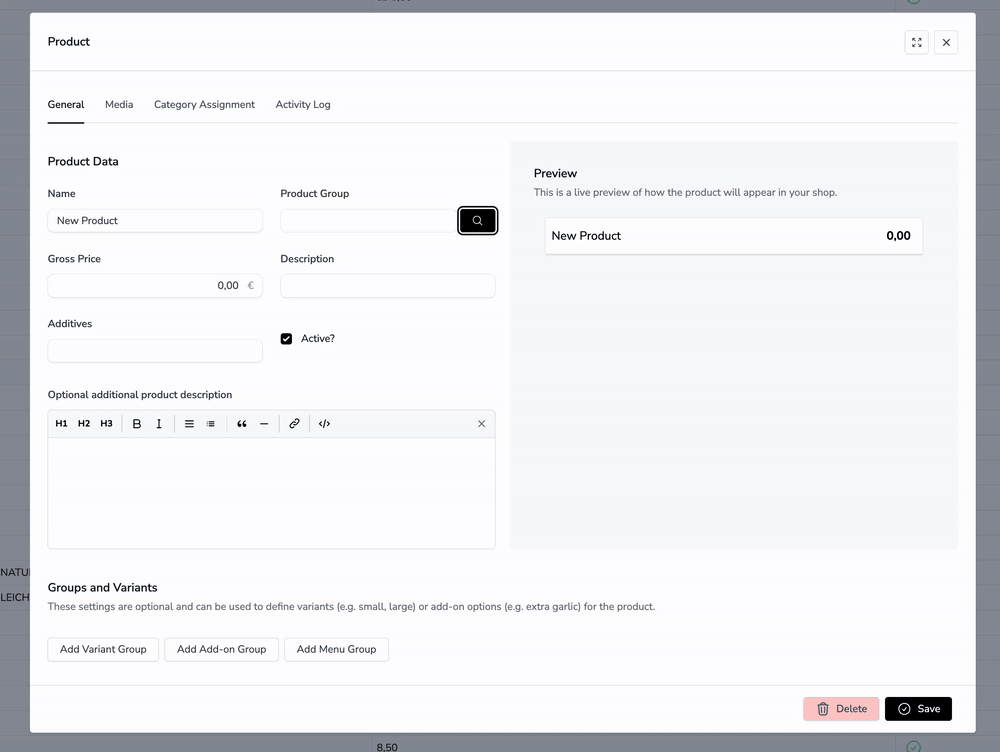

# noerd/modal

**A stacked modal system for Laravel Livewire 4.**<br/>
Open any Livewire component in a modal — no traits, no modifications to your livewire component code.

Modals can also be stacked — open another modal from inside an open one with the same `$modal()` call.



## Installation

```bash
composer require noerd/modal
php artisan noerd:install-modal
```

`noerd:install-modal` publishes `config/noerd-modal.php`. The built Vite assets are published
automatically by the service provider on first boot. Run `php artisan noerd:update-modal` after
upgrading the package (idempotent, also covered by `noerd:update-all`).

Add source path to your resources/css/app.css file
```bash
@source '../../vendor/noerd/modal/resources/views/**/*.blade.php';
```

## Configuration
Add Assets between your head tags.

```bash
<head>
...
<x-noerd::noerd-modal-assets/>
...
</head>
```

Add Modal Component to your layout. Make sure x-data is set on the body tag or any parent element of the modal component, otherwise the modal won't work.
```html
<body x-data>
  <livewire:noerd-modal/>
...
</head>
```

## Example Usage

Opening a Livewire component in a modal via a button
```html
<button type="button"
    @click="$modal('livewire-component-name')">
    Open Modal
</button>
```

If you want to add parameters to your component which is opened in a modal: 
```html
<button type="button"
    @click="$modal('livewire-component-name', { name: 'John Doe' })">
    Open Modal
</button>
```

```php
<?php

use Livewire\Component;

new class extends Component
{
    public string $name = ''; // will be set to John Doe
};
?>

<div class="p-4">
    {{$name}} {{-- Will display John Doe --}}
</div>
```

## Stacked Modals

`$modal(...)` works the same way from inside an already-open modal — there is no extra API and no nesting limit. Calling it pushes a new modal onto the stack on top of the current one.

```html
{{-- Inside a Livewire component that is itself open in a modal --}}
<button type="button"
    @click="$modal('another-livewire-component', { count: '{{ $count }}' })">
    Open another modal on top
</button>
```

Closing follows LIFO order:

- **ESC** closes only the topmost modal.
- Dispatch `closeTopModal` from PHP/Livewire to close the top modal programmatically.
- Dispatch `closeAllModals` to clear the entire stack at once.

Layering is handled automatically: only the top modal is interactive; modals beneath it are dimmed and slightly scaled down — no styling work required on your end.

## Publishing the Example

To publish the example components and a demo route, run:

```bash
php artisan noerd-modal:publish-example
```

This will:
- Copy example components to `resources/views/components/example/`
- Add a route `/noerd-example-modal` to `routes/web.php`

### Example Livewire Starter Kit
If you are using the [Livewire Starter Kit](https://github.com/laravel/livewire-starter-kit)
you can edit the sidebar.blade.php like this example to make noerd modal working

```html
<!DOCTYPE html>
<html lang="{{ str_replace('_', '-', app()->getLocale()) }}" class="dark">
    <head>
        @include('partials.head')
        <x-noerd::noerd-modal-assets/>
    </head>
    <body x-data class="min-h-screen bg-white dark:bg-zinc-800">
        <livewire:noerd-modal/>
```